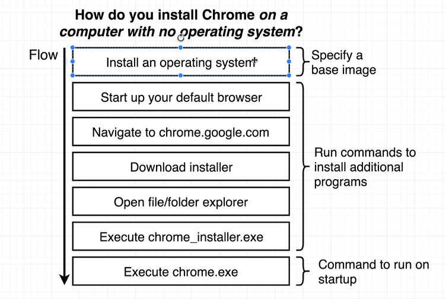

# Docker and Kubernetes: The Complete Guide

This course in on Udemy.com.

<https://www.udemy.com/course/docker-and-kubernetes-the-complete-guide>

## Course Information

- Capital 3 - Video 35

## Dive into Docker

### Why Docker

It helps you deploy and run software in a known environment.
It makes it very easy to install and run software.

### What is docker

Docker is a platform or ecosystem around creating and running containers.

Docker Ecosystem:

- Docker Client
- Docker Server
- Docker Machine
- Docker Images
- Docker Hub
- Docker Compose

### Docker Client

1. run "docker run hello-world"
2. Docker Server looks at local image cache for this image
3. If it's not there it goes to Docker Hub
4. If it finds it there the image gets downloaded.
5. Image gets executed

### Container vs Image

A container is a running image in Docker Server. Container in Docker Server
are seperated through Namespaces and Control Groups.
Each image has an Startup Command to define what program needs to be started
when a container is started.

**Namespaces** are used to separate and isolate resources per process or group of processes.

**Control Groups** limit amount of resources used per process.

### Docker Cache

Docker will cache the order and results of building images. It will cache the
different steps to enable faster rebuilds.

**Attention:** If you change command order in a dockerfile the cache can't be used.

### How it runs on your local Windows or MacOS Machine

Docker run = docker create + docker start

Docker create:

Take the filesystem from an image and use it in an harddrive segment on the host.

Docker Start:

Runs start command of container.

### How you can communicate with a running processs in a container

use -it on command allows you to connect to STDIN on running processes in a container and pretty up output.

## Dockerfile

Configuration to define how our container should behave.

### Commands for a Dockerfile

Base syntax
> \<Instruction\> \<argument to the instruction\>

Specify base image
> FROM \<Base image name\>

Prepare custom image
> RUN \<some instructions\>

Setup start command for container
> CMD ["\<start command\>"]

### Workflow to create a Dockerfile

1. Specify baseimage
2. Run some commands to installer additional programs
3. Specify a command to run on container setup

Compared to installing a Chrome on an empty computer.

## Docker Client command line commands

### Base

get docker version
> docker version

Clear docker. Removes images, containers, networks or build cache
> docker system prune

### Build images

Build an image from a dockerfile in current directory
> docker build .

Build an image from a dockerfile and tag. Tag is version
> docker build -t \<docker id\>/\<repo/project name\>:\<Version\> \<buildcontext\>
> docker build -t alexsnyx/testproject:latest .

Change a running container and create a new image. -c applies a change to a running container.
> docker commit - c 'CMD ["redis-server"]' \<container id\>

### Create to kill containers

Start image with default start command
> docker run \<image name\>

Start image and override start command
> docker run \<image name\> \<some command\>

Create a container from an image and returns a container id
> docker create \<image name\>

Create a container from an image, overrides default command and returns a container id
> docker create \<image name\> \<command\>

Start container
> docker run \<container id\>

Start container and forward container output to current console
> docker start -a \<container id\>

Startup a container and attach a shell after startup.
> docker run -it \<image name\> sh

Stop container.  Sends a SIGTERM to a container and give them some time to clean up.
> docker stop \<container id\>

Stops container immediately. It sends SIGKILL to container.
> docker kill \<container id\>

Remove container
> docker rm \<container id\>

### Interact with running containers

List running containers
> docker ps

List all container ever created
> docker ps --all

Get logs from a container
> docker logs \<container id\>

Execute a command in a running container. -it means connect to STDIN.
> docker exec -it \<container id\> \<command\>

Get access to command line from a container
> docker exec -it \<container id\> sh

### Interact with docker runtime

Connect to docker server shell. (MobyLinuxVM)
> docker run --net=host --ipc=host --uts=host --pid=host -it --security-opt=seccomp=unconfined --privileged --rm alpine /bin/sh

## Linux command line

exit command line (like ctrl + c)
> ctrl + d

List directory
> ls

Create a new file
> touch \<filename\>

## Node.js sample project

Create a node.js web application. Run it in a container and
access it from browser in hosting environment.

### 